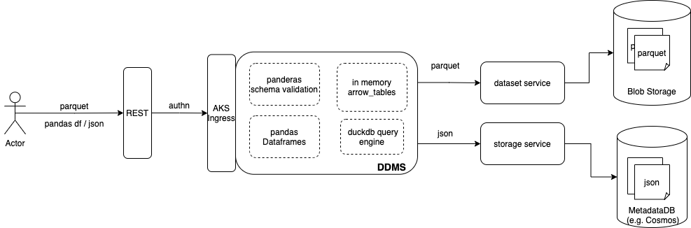

# RAFS DDMS Framework

## Components
The current architecture is shown in following diagram

Notes about current (MVP1) implementation:
- Uses dataset api to store parquet data
- Uses user access token for the OSDU core services API invocation
