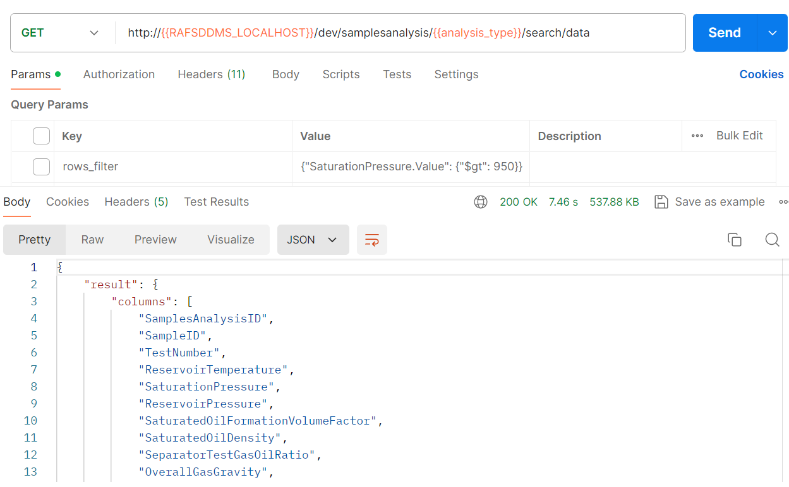

# Features in Development: **dev** version

While the RAFSDDMS is publicly released and available, the community continues to actively develop and enhance the service. This ongoing work includes changes to API contracts and data models, as well as the addition of new functionalities.

Frequent version bumps for each backward-incompatible change can make API management challenging. To address this issue, a **dev** version of the API is being added and maintained.


## **dev** version

A **dev** version has been introduced to support new or experimental changes that may potentially be incompatible (breaking) with the current **v2** version.

### **dev** version directory structure

The **dev/** directory structure mirrors that of **app/** and **tests/**. This design allows for seamless promotion of new features to a stable version, as the involved directories and modules can be easily moved to their respective locations within **app/** and **tests/**.

```
app/
    ├── dev/
    │   ├── api/
    │   │   │   ├── dependencies/
    │   │   │   └── ...
    │   │   └── routes/
    │   │   │   └── v_dev/
    │   │   │   │   └── ...
    │   ├── dataframe/
    │   │   └── ...
test/
    ├── dev/ 
    │   └── ...
    └── ...
```

### Adding a new feature
To add a new feature in development, it is recommended to reuse existing code as much as possible and place only the new code into the **dev/** folder.

# Current Features in Development

## Filters and Aggregation

Currently, the following query parameters are supported for performing filtering and aggregation over the properties in a given analysis type schema:
- **_columns_filter_**
- **_columns_aggregation_**
- **_rows_filter_**
- **_rows_multiple_filter_**

### Properties Dotted (Flattened) Notation

**_columns_aggregation_**, **_rows_filter_**, and **_rows_multiple_filter_** support `ColumnName.PropertyName.SubPropertyName` dotted notation, also known as flattened property syntax, to work with nested properties.

In general:
- **_columns_aggregation_** works for any nested level with any number of arrays of objects.
- **_rows_filter_** and **_rows_multiple_filter_** support limited scenarios. See the Rows Filter section for supported cases.
- **_columns_filter_** does not support dotted notation.

### Column Filters

**_columns_filter_** format is a valid JSON array of projected column names:

```json
["ColumnName1", "ColumnName2"]
```

**_columns_filter_** valid columns are available only for top-level properties. For example, for the [NMR schema](../../app/models/data_schemas/jsonschema/api_v2/nmr_data_schema.json), the following properties are available when using **_columns_filter_**:

```json
[
    "SamplesAnalysisID",
    "SampleID",
    "NMRTest"
]
```

### Rows Filters and Multiple Rows Filters

**_rows_filter_** is a valid JSON object that represents a single condition with the following format:

```json
{
    "{property_name}": {
        "{operator}": "{value}"
    }
}
```

**_rows_multiple_filter_** is a valid JSON object that represents a set of conditions with the following format:

```json
{
    "{logical_operator}": [
        {"{property_name_1}": {"{operator}": "{value}"}},
        {"{property_name_2}": {"{operator}": "{value}"}},
        {
            "{logical_operator}": [
                {"{property_name_3}": {"{operator}": "{value}"}},
                {"{property_name_4}": {"{operator}": "{value}"}}
            ]
        }
    ]
}
```

#### Valid Operators

<u>operators</u> are strings, and their math operator equivalents are described in the following dictionary:

```json
 {"$lt": "<", "$gt": ">", "$lte": "<=", "$gte": ">=", "$eq": "=", "$neq": "!="}
```

#### Valid Logical Operators

<u>operators</u> are strings:

```json
 {"$and", "$or"}
```

#### Property Name and Value

**property_name** and **value** are validated against the model schema.

A flattened **property_name**, i.e., _PropertyA.SubPropertyB.SubsubpropertyC.SubsubsubPropertyD_, is correct if it falls under one of the following cases (brackets are illustrative and mark a property as an array):

- None of the flattened properties is an array of objects:
    - "PropertyA.SubPropertyB.SubsubpropertyC.SubsubsubPropertyD"
- Only one of the flattened properties is an array of objects:
    - "PropertyA<b>[]</b>.SubPropertyB.SubsubpropertyC.SubsubsubPropertyD"
    - "PropertyA.SubPropertyB<b>[]</b>.SubsubpropertyC.SubsubsubPropertyD"
- If two flattened properties are arrays, the first property should be array:
    - "PropertyA<b>[]</b>.SubPropertyB<b>[]</b>.SubsubpropertyC.SubsubsubPropertyD"
- Other scenarios, where two or more flattened properties are arrays, are not supported:
    - "PropertyA<b>[]</b>.SubPropertyB<b>[]</b>.SubsubpropertyC<b>[]</b>.SubsubsubPropertyD"
    - "PropertyA.SubPropertyB<b>[]</b>.SubsubpropertyC<b>[]</b>.SubsubsubPropertyD"

A **value** is correct if it can be cast to the type defined in the schema.

#### Example of Rows and Columns Filter

Example of a request using both filters on previously ingested Relative Permeability content data:
Filter only the "InitialConditions" column and only the rows where "InitialConditions.EffectivePermeability.Value" is less than 5000.

```sh
curl --location '{RAFS_DDMS_URL}/dev/samplesanalysis/{SamplesAnalysisID}/data/relativepermeability/{DatasetID}?rows_filter={%22InitialConditions.EffectivePermeability.Value%22%3A%20{%22%24lt%22%3A%205000}}&columns_filter=[%22InitialConditions%22]' \
--header 'Authorization: Bearer token' \
--header 'data-partition-id: opendes' \
--header 'Content-Type: application/json' \
--header 'Accept: */*;version=1.0.0'
```

### Columns (or Properties) Aggregation

**_columns_aggregation_** works over the entire response result or over a filtered one, using the following format, which is a valid JSON array: ```["ColumnName[.FieldName]", "aggregation_function"]```.

Supported aggregations depend on column (or property) type, but generally, the following are supported:

```json
["mean", "count", "max", "min", "sum", "describe"]
```

#### Example of Columns Aggregation

Obtaining the "mean" value of "InitialConditions.EffectivePermeability.Value" of a Relative Permeability analysis type:

```sh
curl --location --globoff '{RAFS_DDMS_URL}/api/rafs-ddms/dev/samplesanalysis/{SamplesAnalysisID}/data/relativepermeability/{DatasetID}?columns_aggregation=[%22InitialConditions.EffectivePermeability.Value%22%2C%20%22mean%22]' \
--header 'Authorization: Bearer token' \
--header 'data-partition-id: opendes' \
--header 'Content-Type: application/json' \
--header 'Accept: */*;version=1.0.0'
```

## Dev Search Endpoints

Search endpoints are used to retrieve data related to a set of analysis types given a filter (or query).

### Search

Used to retrieve a list of work-product-component--SamplesAnalysis record IDs for a given analysis type.


- If the search is provided without parameters (without filters), the result set will include all samples analysis IDs found for the given type which contains content data.
- If the search is provided with filters as query parameters, the result set will include only the samples analysis IDs that comply with the given filters.
- Query filter parameters work as described for filter and aggregation for single content retrieval.

#### Example

Retrieve all samples analysis IDs for analysis_type=multistageseparator where the SaturationPressure is greater than 950 psi.


### Search Data

Used to retrieve a concatenated dataframe of all content found for a given analysis type.


- If the search is provided without parameters (without filters), the concatenated result will include all analysis types which contain content data.
- If the search is provided with filters as query parameters, the concatenated result will include only the analysis types that comply with the given filters.
- Query filter parameters work as described for filter and aggregation for single content retrieval.

#### Example

Retrieve all multistageseparator tests where the SaturationPressure is greater than 950 psi.


#### More Examples with Multiple Rows Filter

Examples can be found in the [Search_and_Filters](../../notebooks/Search_and_Filters.ipynb) notebook.

### Metadata Filtering

In addition to filtering within content schemas, the result set of an analysis can be further refined using the metadata filter.

#### Available Fields
The following fields are available for filtering, based on the defined [SamplesAnalysis schema](../../app/dev/core/helpers/redis_index.py):
- "SampleIDs"
- "SampleTypeIDs"
- "ParentSamplesAnalysesReports"
- "WellboreIDs"
- "WellboreNames"
- "BasinIDs"
- "BasinNames"
- "FieldIDs"
- "FieldNames"

#### Metadata Query Format
The metadata is passed as a query parameter, formatted as a JSON string:
```json
{
    "FieldNameA": ["ValueA1", "ValueA2"],
    "FieldNameB": ["ValueB1"]
}
```
Each field name must be one of the available fields listed above.

#### Metadata $and and $or Behavior
Field names should be unique keys, with different keys representing conjunctions ($and). The values within each field's array represent disjunctions ($or).

For example, the following metadata filter will return all related sample analyses from either WellboreID1 or WellboreID2:
```json
{
    "WellboreIDs": ["WellboreID1", "WellboreID2"]
}
```

The following metadata filter will return all related sample analyses from either WellboreID1 or WellboreID2, and also match SampleTypeID1:
```json
{
    "WellboreIDs": ["WellboreID1", "WellboreID2"],
    "SampleTypeIDs": ["SampleTypeID1"]
}
```

#### Request Example
To retrieve all Routine Core Analysis data from a specific wellbore (using WellboreID), you can use the following query:


### QA Collection
For a more comprehensive set of examples, refer to the [QA Postman collection](https://community.opengroup.org/osdu/qa/-/blob/main/Dev/48_CICD_Setup_RAFSDDMSAPI/RAFSDDMS_API_CI-CD_v1.0.postman_collection.json?ref_type=heads).
