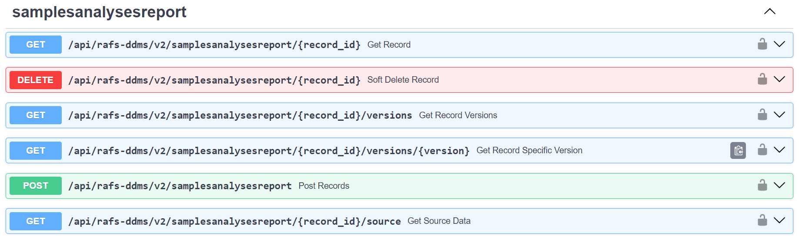
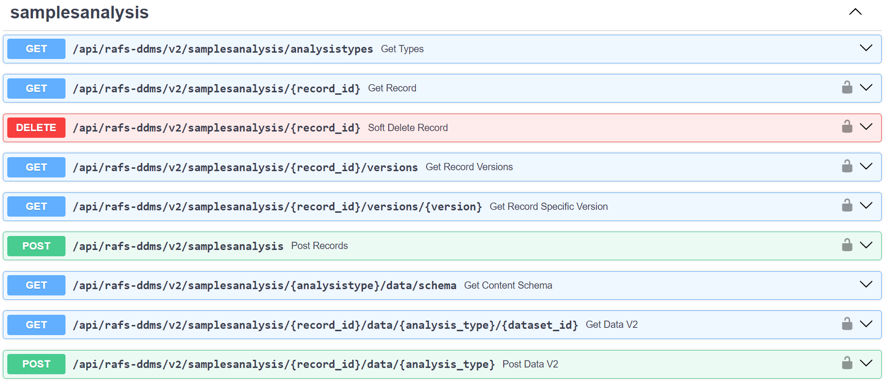
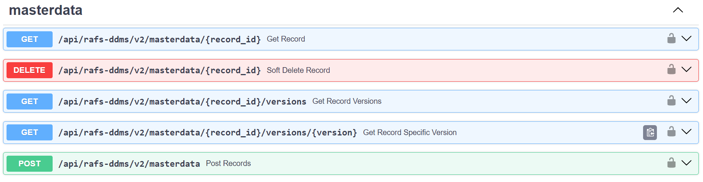
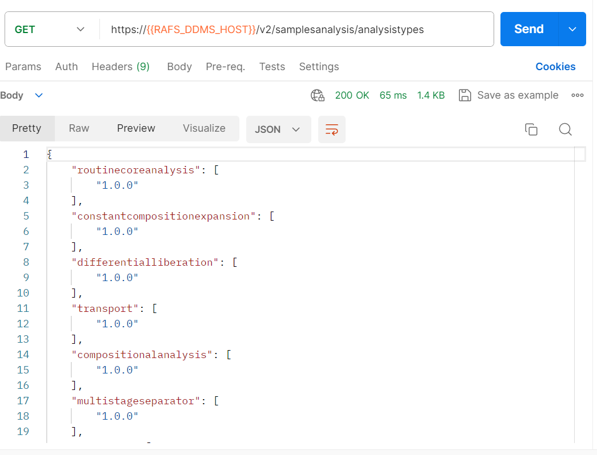
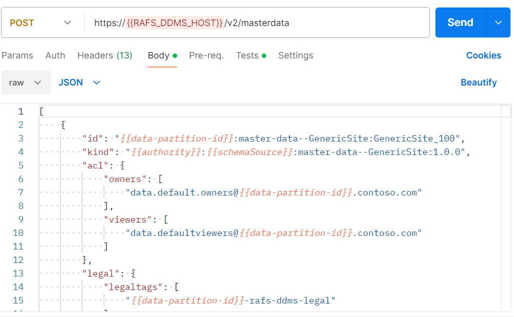
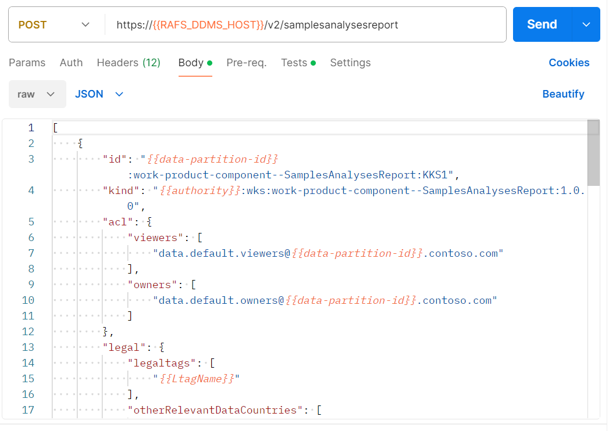
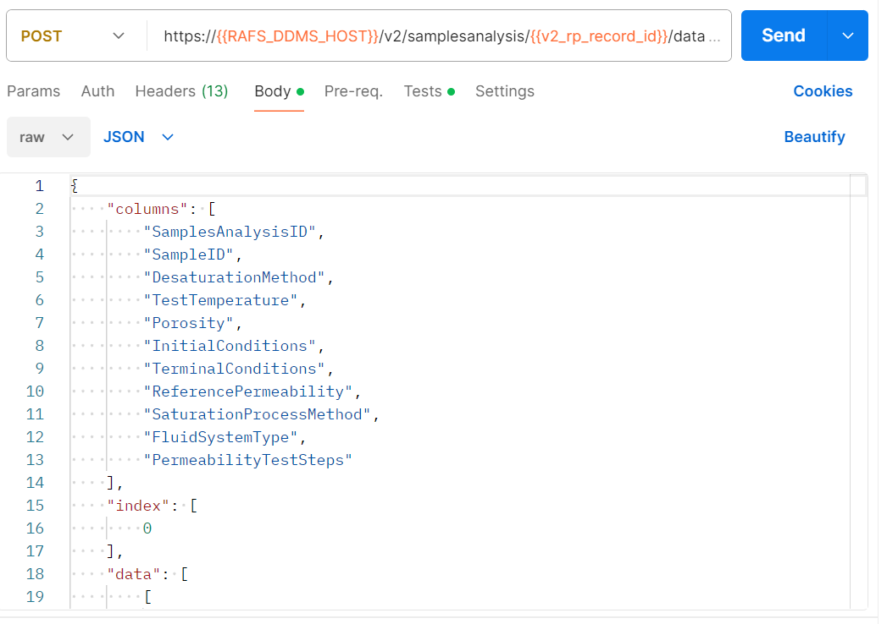
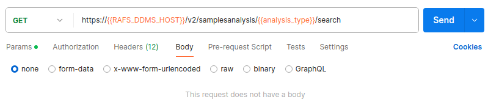
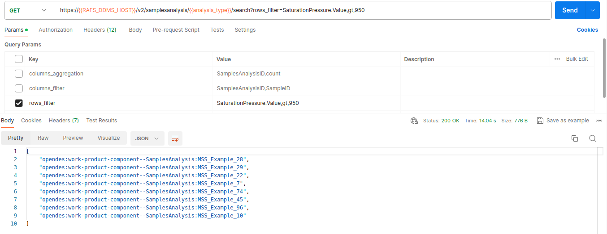
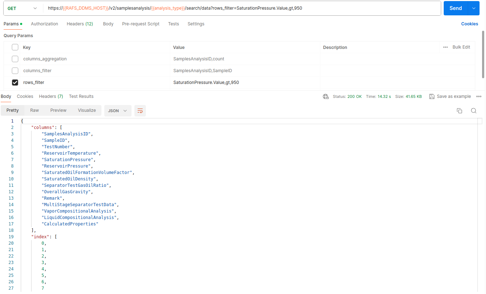

# RAFS DDMS Tutorial Api V2

## Getting started
The RAFSDDMS supports the following set of endpoints:
- Ingestion of [SamplesAnalysesReport](https://community.opengroup.org/osdu/platform/system/schema-service/-/blob/master/deployments/shared-schemas/osdu/work-product-component/SamplesAnalysesReport.1.0.0.json?ref_type=heads) metadata

- Ingestion of [SamplesAnalysis](https://community.opengroup.org/osdu/platform/system/schema-service/-/blob/master/deployments/shared-schemas/osdu/work-product-component/SamplesAnalysis.1.0.0.json?ref_type=heads) metadata and content data

- Ingestion of MasterData metadata


#### Pre-requisites
- [Required] Have ready acl, legal and all required info for RockSampleAnalysis metadata ingestion
- [Required] Have access and permissions to the data partition
- [Required] Have uploaded [all refernce-data schemas with rafsddms authority](../../deployments/rafsddms_schemas_mvp.postman_collection.json) and [all reference-data values](../../deployments/rafsddms_ref_data_manifests_mvp.postman_collection.json)

#### Api V2 details
Get familiar with Api V2 documentation in [REST docs](../spec/openapi.json)

## Ingestion order
1. Ingest medatadat: Master Data, SamplesAnalysesReport, SamplesAnalysis
2. Ingest Specific Analysis Content

#### Example: Ingest MasterData (applies for SamplesAnalysesReport and SamplesAnalysis in its respective endpoints)
1. Prepare json file to comply with any of the following schemas 
- ```osdu:wks:master-data--GenericFacility:1.0.0```
- ```osdu:wks:master-data--GenericSite:1.0.0```
- ```osdu:wks:master-data--Sample:2.0.0```
- ```osdu:wks:master-data--SampleAcquisitionJob:1.0.0```
- ```osdu:wks:master-data--SampleChainOfCustodyEvent:1.0.0```
- ```osdu:wks:master-data--SampleContainer:1.0.0```

2. Issue following POST request:
```
curl --location --request POST '{RAFS_DDMS_URL}/api/rafs-ddms/masterdata' \
--header 'Content-Type: application/json' \
--header 'data-partition-id: opendes' \
--header 'Authorization: Bearer token' \
--data-raw '{
    "id": "{data_partition_id}:master-data--Sample:Test_Example",
    ...
   }'
```
Response should be an id with its corresponding version, i.e.,  ```{data_partition_id}:master-data--Sample:Test_Example:1673921980922175```

3. Get the record with following GET request:
```
curl --location --request GET '{RAFS_DDMS_URL}/api/rafs-ddms/masterdata/{data_partition_id}:master-data--Sample:Test_Example' \
--header 'Content-Type: application/json' \
--header 'data-partition-id: opendes' \
--header 'Authorization: Bearer token'
```
4. Alternatively, get the all versions of a record and fetch the specific version with following endpoints, respectively:
```
{RAFS_DDMS_URL}/api/rafs-ddms/masterdata/{data_partition_id}:master-data--Sample:Test_Example/versions
{RAFS_DDMS_URL}/api/rafs-ddms/masterdata/{data_partition_id}:master-data--Sample:Test_Example/versions/{VERSION_NUMBER}
```
## End to end example using QA Postman collection.
The latest collection is located at [QA Collection](https://community.opengroup.org/osdu/qa/-/blob/main/Dev/48_CICD_Setup_RAFSDDMSAPI/RAFSDDMS_API_CI-CD_v1.0.postman_collection.json?ref_type=heads).

### Consult available analysis types and their schemas
1. Use the `GET all available analysis types`. 
2. [Optionally] Get specific schema of any available type, for example for relativepermeability with version 1.0.0 use the following request
```
curl --location --request GET '{RAFS_DDMS_URL}/v2/samplesanalysis/relativepermeability/data/schema' \
--header 'Content-Type: application/json' \
--header 'data-partition-id: opendes' \
--header 'Authorization: Bearer token' \
--header 'Accept: */*;version=1.0.0' \
```

### Ingest RelativePermeability Data

1. Use the `Configure collection/{Auth|Create related records}` folders to start
    - Refresh the token 
    - Create a legal tag
    - Create needed master data 
2. Use the `v2/Samples Analyses Report KentishKnockSouth1 SCAL` folder
    - create the record (request number 1). 
    - [Optionally] Get the record, list versions or get any specific version(requests number 2,5 or 6)
3. Use the `v2/SamplesAnalysis [RelativePermeability]` folder
    - create the record (request number 1). 
    - [Optionally] Get the record, list versions or get any specific version (request  number 2, 5 or 6)
    - Add the relative_permeability content data (request  number 3). 
    - Get the recently added relative permeabulity data (request number 4). 

### Filters and Aggregation
Filter and aggregation are only available for top level properties. For example for Relative Permeability schema the following properties are available when using filters and aggregators.
```
[
    "SamplesAnalysisID",
    "SampleID",
    "DesaturationMethod",
    "TestTemperature",
    "Porosity",
    "InitialConditions",
    "TerminalConditions",
    "ReferencePermeability",
    "SaturationProcessMethod",
    "FluidSystemAnalysisType",
    "PermeabilityTestSteps"
]
```

#### Filtering
There are two types of filtering: column and row filtering.

_columns_filter_ is a comma separated list of projected column names ```ColumnName1,ColumnName2```

_rows_filter_ is a comma separated list that represent a condition (current implementation only allows a single condition) with the following format ```ColumnName,Operator,Value```

Valid operators are strings and their math operator equivalent is decribed in following dictionary:
```
 {"lt": "<", "gt": ">", "lte": "<=", "gte": ">=", "eq": "=", "neq": "!="}
```

Example of a request using both filters on the previous ingested RelativePermeability content data

```
curl --location '{RAFS_DDMS_URL}/v2/samplesanalysis/{SamplesAnalysisID}/data/relativepermeability/{DatasetID}?columns_filter=SampleID%2CDesaturationMethod&rows_filter=DesaturationMethod%2Ceq%2Copendes%3Areference-data--DesaturationMethod%3ACentrifugeGasWater%3A' \
--header 'Authorization: Bearer token' \
--header 'data-partition-id: opendes' \
--header 'Content-Type: application/json' \
--header 'Accept: */*;version=1.0.0'
```

#### Aggregation
_columns_aggregation_ works over the entire response result or over a filtered one. With the following syntax ```ColumnName,aggregation```.

Supported aggregations depends on column type but in general:
```
[mean, count, max, min, sum, describe]
```

```
curl --location '{RAFS_DDMS_URL}/v2/samplesanalysis/{SamplesAnalysisID}/data/relativepermeability/{DatasetID}?columns_aggregation=DesaturationMethod%2Ccount' \
--header 'Authorization: Bearer token' \
--header 'data-partition-id: opendes' \
--header 'Content-Type: application/json' \
--header 'Accept: */*;version=1.0.0'
```

#### Doted notation

_columns\_aggregation_ and _rows\_filter_ support ```ColumnName.FieldName``` syntax to work over nested fields.

Example, get the mean of the result set where TestTemperature value is above 10 degF:
```
curl --location '{RAFS_DDMS_URL}/v2/samplesanalysis/{SamplesAnalysisID}/data/relativepermeability/{DatasetID}?rows_filter=TestTemperature.Value%2Cgt%2C10&columns_aggregation=TestTemperature.Value%2Cmean' \
--header 'Authorization: Bearer token' \
--header 'data-partition-id: opendes' \
--header 'Content-Type: application/json' \
--header 'Accept: */*;version=1.0.0'
```

## Search endpoints
Search endpoints are used to retrieve data related to a set of analysis types given a filter (or query)

### Search
Used to retrieve a list of work-product-component--SamplesAnalysis record ids for given analysis type.

- If the search is provided without parameters (without filters) the result set will include all samples analysis ids found for given type which contains content data.
- If the search is provided with filters as query params the result set will only include the samples analysis ids that comply with given filters
- Query filter params works as described for filter and aggregation for single content retrieval.

#### Example
Retrieve all samples analysis ids for analysis_type=multistageseparator where the SaturationPressure is greater than a 950 psi


### Search Data
Used to retrieve a concanated dataframe of all content found for a given analysis type.

- If the search is provided without parameters (without filters) the concatenated result will include all analysis types which contains content data.
- If the search is provided with filters as query params the concatenated result will only include the analysis types that comply with given filters
- Query filter params works as described for filter and aggregation for single content retrieval.

#### Example
Retrieve all multistageseparator test where the SaturationPressure is greater than a 950 psi


#### Deprecated Api V1
API v1 is deprecated and therefore is not covered in the tutorial.
